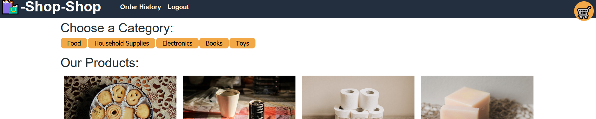

# Book Search Engine

## Summary  

This program is a e-commerce platform that was built using MERN Stack. It is now refactored using Redux instead of React's context API for state management throught the site.
## Installation

install Node. After install node type the following
npm run install
npm run develop

## Website

https://redux-store-sza.herokuapp.com/

## Resources used

https://www.digitalocean.com/community/tutorials/how-to-manage-state-in-react-with-redux
 
https://www.codehousegroup.com/insight-and-inspiration/tech-stream/using-redux-and-context-api

## Tools used

Node, Express, React, Appolo, GraphQL, Redux and Mongoose.

## Contributors

Zohaib Ali

